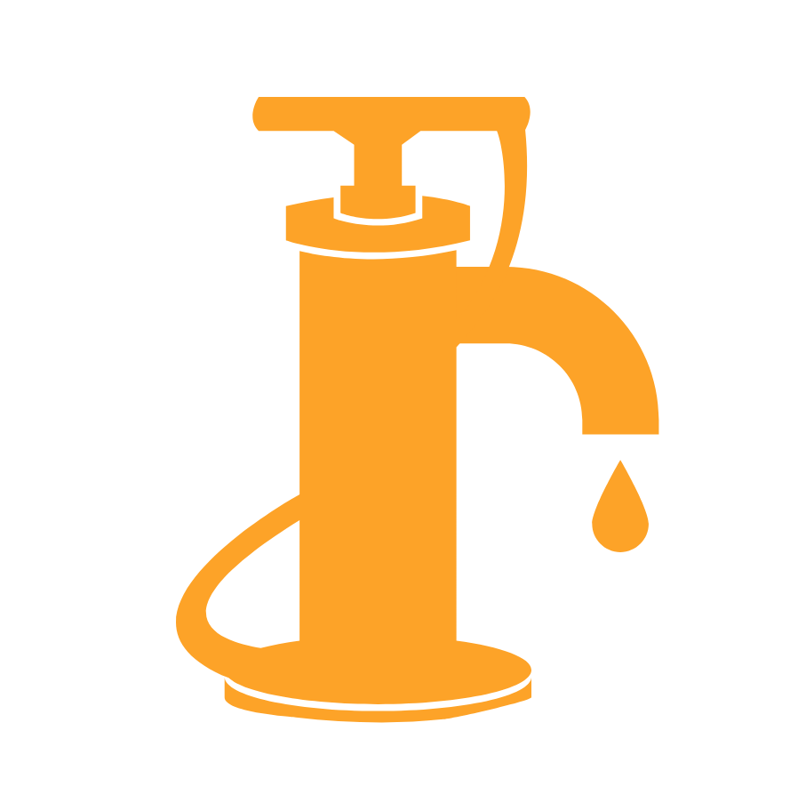

# Waterpump

Multi Purpose Dependency Injection

# Install

```bash
npm install waterpump
```

# Usage

Self explanatory

```javascript
// a.js
module.exports = (ports) => ({
  one() {
    return ports.b.two()
  },

  three() {
    return 'something'
  }
})

// b.js
module.exports = (ports) => ({
  two() {
    return ports.a.three()
  }
})

// main.js
const { register } = require('waterpump')()

const a = register('a', require('./a'))
const b = register('b', require('./b'))

console.log(a.one())
```
